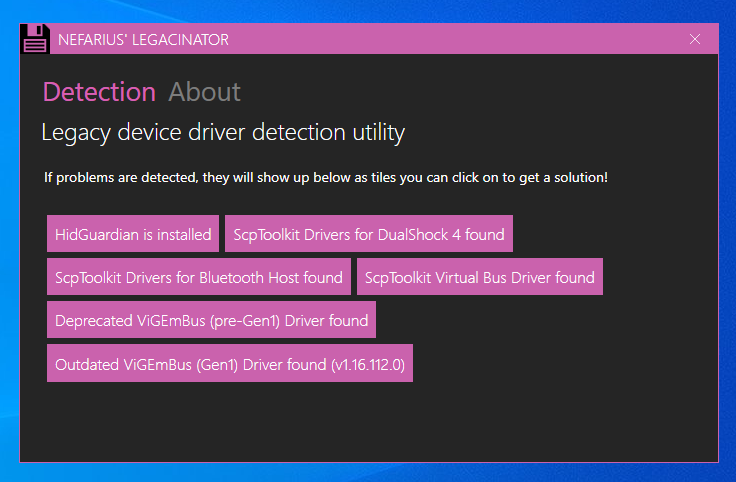
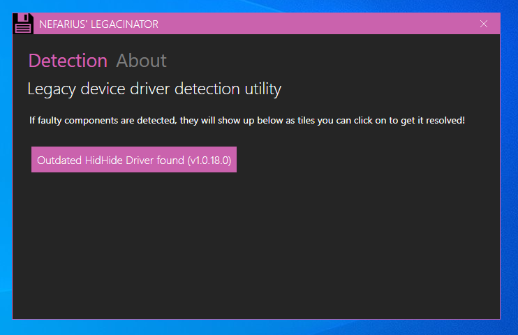
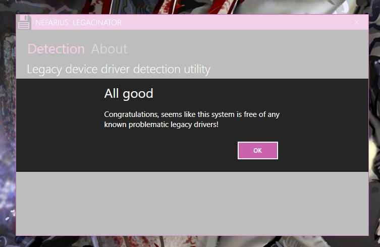

# Nefarius' Legacinator

 

The one and only Legacinator.

## About

Ever wondered why that darn game controller just won't show up in games, Steam or your favourite emulator? Machine crashes once you plug in a DualShock 3/4? Struggling with getting that lid off of your pickles jar? Well, I can't help you with that, but for the game controller issues, read on!

The Legacinator is a simple self-contained .NET 4.8 application that has one task: it scans your machine for traces of known legacy (outdated, potentially faulty) device drivers (leftovers from [ScpToolkit](https://github.com/nefarius/ScpToolkit), outdated [ViGEmBus](https://github.com/ViGEm/ViGEmBus) copies etc.) and provide a solution to the user.

## Features

- Detects and removes drivers from [ScpToolkit](https://github.com/nefarius/ScpToolkit) installations
- Detects and removes [HidGuardian](https://github.com/ViGEm/HidGuardian)
- Detects and removes outdated versions of [ViGEmBus](https://github.com/ViGEm/ViGEmBus)
- Detects and removes outdated versions of [HidHide](https://github.com/ViGEm/HidHide)
- Detects the [HP fork of ViGEmBus from 2018](https://github.com/ViGEm/ViGEmBus/issues/99) and offers mitigation instructions

## Environment

This tool was built for **Windows 10**. Anything lower might work but is not supported. Since .NET 4.8 ships with Windows, the tool should be ready to run once downloaded.

## Download

🚨 **This is fairly young software so Anti-Virus might complain** 🚨

[Get the latest signed release from here](../../releases/latest). If you feel adventerous, you can [get the latest test build from here](https://ci.appveyor.com/api/projects/nefarius/legacinator/artifacts/bin%2FRelease%2FLegacinator.exe).

## Usage examples

If you run the tool on a machine with legacy components, the window will fill up with one or more tiles listing components found:

Clicking them will either attempt an instant automatic fix or open a link to online articles on how to get rid of them in a safe and supported way. A few more detection examples:

On a "clean" machine you simply get a success dialog:

## Sources & 3rd party credits

- [MahApps.Metro](https://github.com/MahApps/MahApps.Metro)
- [Fody Costura](https://github.com/Fody/Costura)
- [Nefarius.Utilities.DeviceManagement](https://github.com/nefarius/Nefarius.Utilities.DeviceManagement)
